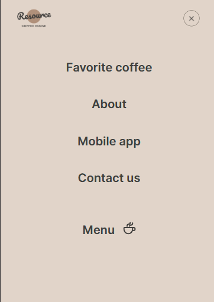
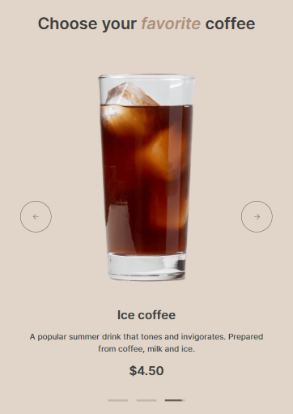
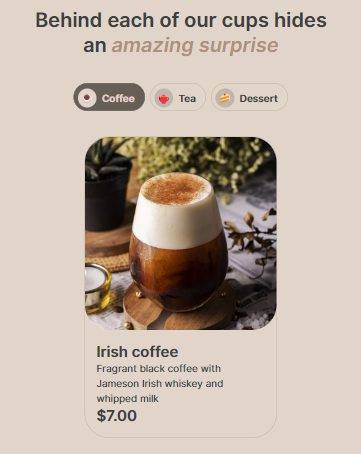
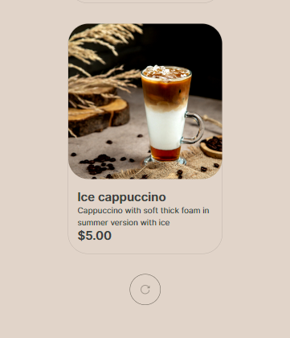
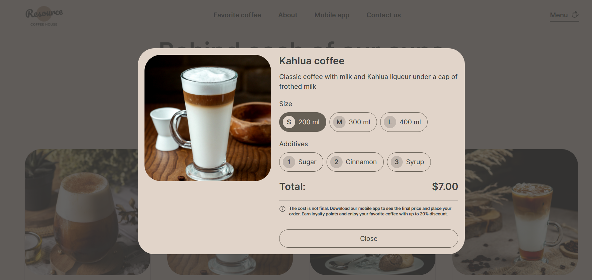
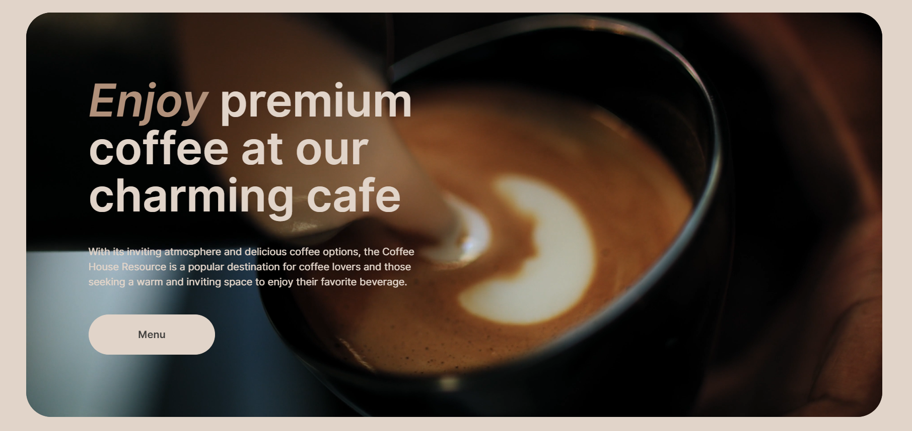

# Coffee House

**Coffee House** is a website for a coffee shop featuring a product catalog. The project is built strictly according to the provided layout, with a focus on responsiveness, visual appeal, and interactive elements. The site is designed in line with modern UI/UX standards and showcases skills in layout development and native JavaScript.

It's a [training project](https://github.com/rolling-scopes-school/tasks/blob/master/tasks/coffee-house/coffee-house.md) developed as part of the [RS School](https://rs.school/) "Frontend" course in December 2023.

## Table of Contents
- [Coffee House](#coffee-house)

## Demo
**Live Demo:** [Open the website](https://cherkasovaa.github.io/coffee-house/)

## Key Features
- Adaptive and responsive layout (desktop first)
- Pixel Perfect based on Figma design
- Modal logic with real-time price calculation
- Interactive carousel with auto-play and swipe support
- Video background integration

## Functionality

### Burger Menu

**Description:** Opens and closes the burger menu on pages with a screen width of 768px and less.

**Screenshot:** 

### Carousel

**Description:** Auto-playing carousel with smooth transitions and a progress bar. Supports swipe gestures (mobile) and arrow buttons (desktop). Slides loop infinitely.

**Screenshot:**

### Category Switching

**Description:** Switches products by category (e.g., Coffee / Tea / Dessert) on the menu page. Default category on load: "Coffee".

**Screenshot:**

### Loading More Products

**Description:** On screens ≤768px only 4 products are shown per category. If there are more, the "Load More" button reveals the rest. Responsive behavior updates dynamically on screen resize.

**Screenshot:**

### Modal Window

**Description:** Clicking on a product opens a centered modal window. Size (S/M/L) selection adjusts the price. Add-ons can be toggled to increase total cost.

**Screenshot:**

### Video Background

**Description:** The "Enjoy" block on the homepage includes a muted, looping, autoplaying background video with no controls.

**Screenshot:**

## Technologies
- HTML5
- CSS3 (SCSS)
- JavaScript (ES6+)
- Vite
- ESLint
- Prettier
- Stylelint
- Husky + lint-staged
- Pixel Perfect / Desktop-First